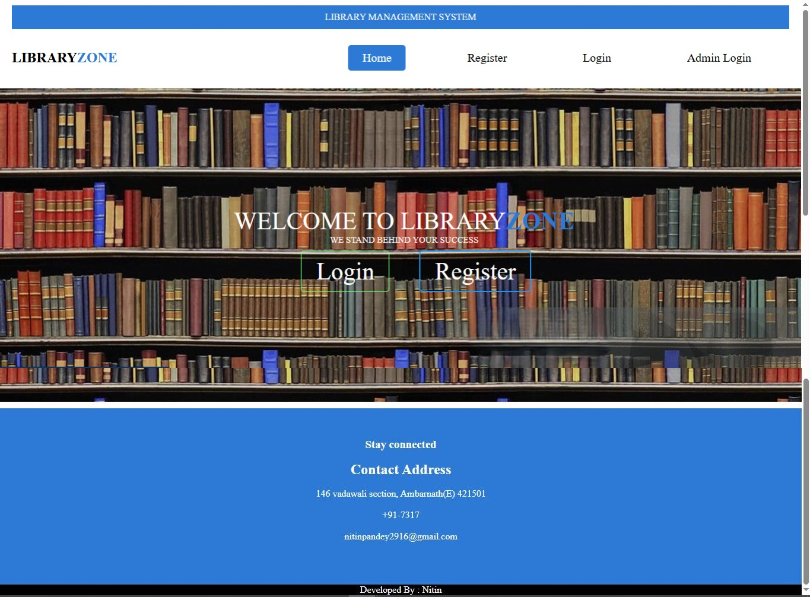
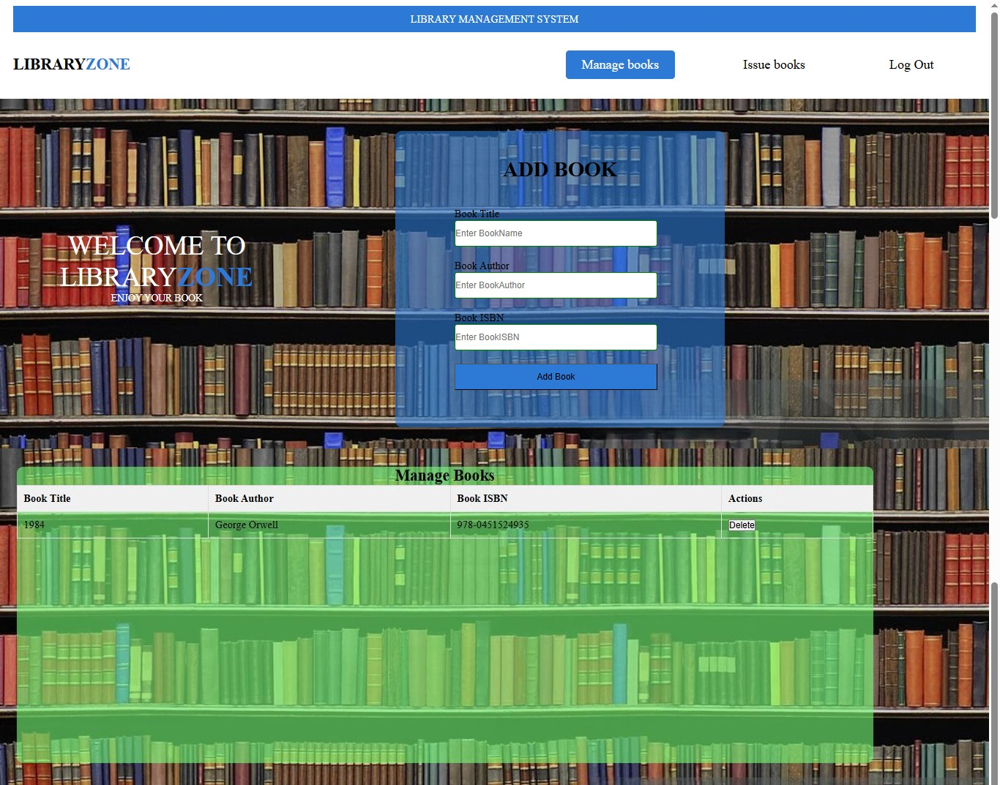
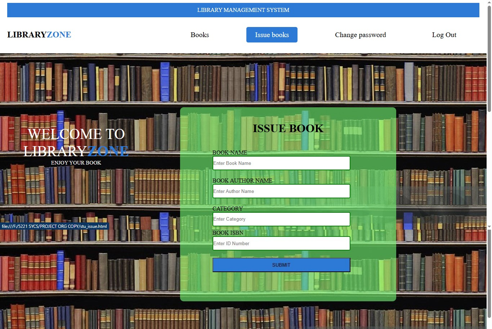

# 📚 LIBRARYZONE - Library Management System

> **LIBRARYZONE** is a web-based Library Management System designed to streamline the operations of a library. It provides distinct portals for **Administrators**, **Teachers**, and **Students** to manage books, issue records, and user profiles efficiently.

---

## 🚀 Key Features

### 🔐 authentication & Roles
* **Admin Login:** Secure access for librarians to manage the entire system.
* **User Registration:** Separate registration forms for **Students** (with Course selection) and **Teachers** (with Department selection).
* **User Login:** Dedicated login panels for students and teachers.

### 👨‍💼 Admin Modules
* **Dashboard:** Quick access to manage and issue books.
* **Manage Books:** Add new books with details (Title, Author, ISBN) and view the inventory.
* **Issue Books:** Track issued books, view due dates, and manage returns.

### 👨‍🎓 Student & Teacher Modules
* **View Books:** Browse the list of available books in the library.
* **Issue Book Request:** Form to request a book issue with category and ISBN.
* **Change Password:** Feature to update account security.
* **Profile Management:** User-specific dashboard.

---

## 📸 Screenshots

| **Home Page** | **Registration Page** |
|:---:|:---:|
|  |  |

| **Admin Manage Books** | **Student Panel** |
|:---:|:---:|
|  |  |

| **Issue Book Form** | **Login Page** |
|:---:|:---:|
|  |  |

---

## 🛠️ Tech Stack Used

* **Frontend Structure:** HTML5
* **Styling:** CSS3 (Custom responsive design with Flexbox)
* **Icons:** FontAwesome 4.7.0
* **Scripting:** Vanilla JavaScript (DOM Manipulation)

---

## 📂 Project Structure

```text
LIBRARYZONE/
├── index.html          # Main Login Landing Page
├── home.html           # Home Page
├── admin.html          # Admin Login
├── register.html       # Registration Page
├── admin_panel.html    # Admin Dashboard
├── manage_book.html    # Book Inventory Management
├── issue_book.html     # Admin Issue Management
├── student_panel.html  # Student Dashboard
├── stu_book.html       # Student Book View
├── tea_panel.html      # Teacher Dashboard
├── tea_book.html       # Teacher Book View
├── css/                # Contains all .css files (s1.css to s15.css)
├── js/                 # Contains script.js and script2.js
└── images/             # Backgrounds and Assets

```

---

## ⚡ How to Run

1. **Clone the repository** (or download the zip file):
```bash
git clone [https://github.com/yourusername/libraryzone.git](https://github.com/yourusername/libraryzone.git)

```


2. **Navigate to the project folder**.
3. **Open the file:**
Double-click on `home.html` or `index.html` to open the application in your web browser.

---

## 👤 Author

**Nitin Vinay Pandey**

* Developer & Designer

---

*Note: This project is a frontend prototype demonstrating the UI/UX and logic flow of a Library Management System.*
